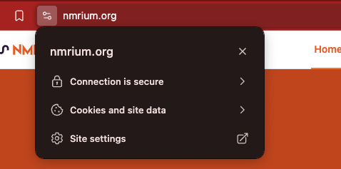
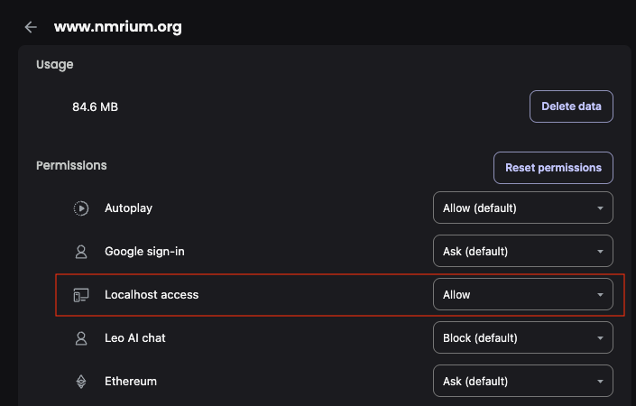
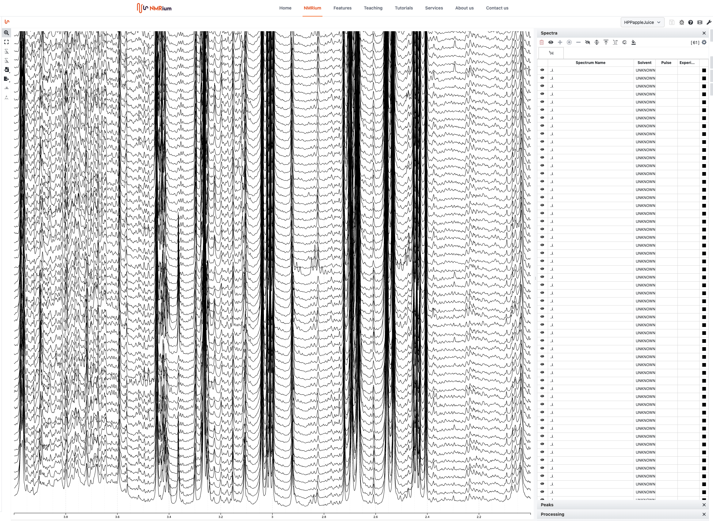
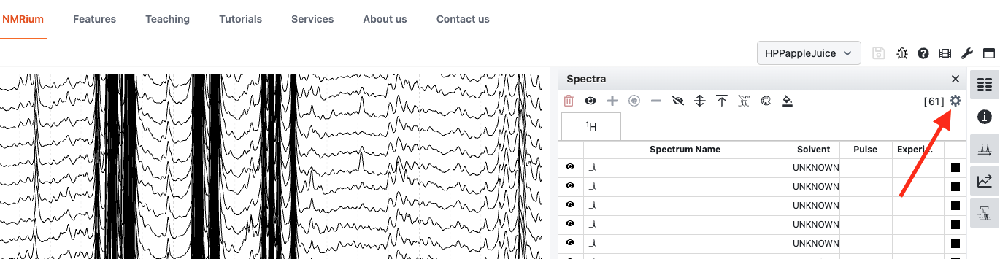
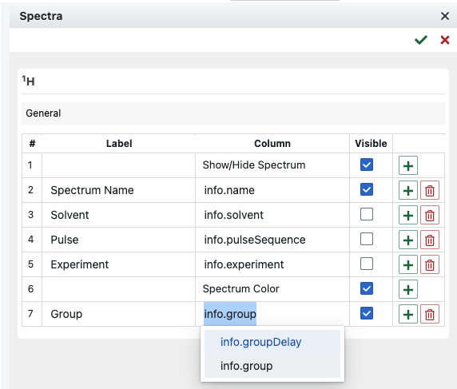
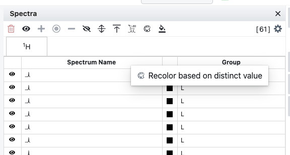

R is a powerful software for data analysis, but it is not so good at interactive plotting. `nmr.spectra.processing` implements a function that interfaces with nmrium to allow interactive 1D spectra visualization (zoom etc.) and processing (peak picking, integration, phase correction, assignment) from the web browser. Since this implies setting up a http server to access local files, some additional steps are needed to keep everything up and running.

# Browser setup

We need to grant nmrium access to local files. Currently I use Brave in macOS, where this is very easy to setup: go to https://www.nmrium.org/ and click the icon to the left of the url to access the site settings menu



You are about to grant great power and great responsibility, so make sure you are in the right place before you proceed!

From the site settings menu, go to "Permissions" and set "Localhost access" to "Allow"

{width=80%}

Alternatively, you can configure the site permissions from the *Settings > Privacy and security* menu.

A similar approach should work in other web browsers.

# Export and visualize

Now that you are all set, you need to 1) export your data to a format that nmrium can read; 2) initialize a http server to access these files; and 3) have nmrium read and display your data. All these tasks have been implemented in the package `hastaLaVista2` and collected in a convenient wrapper function in `nmr.spectra.processing`, so that you can get it all done in a single line of code.

But first, we need to load some NMR data:

```{r}
load(url("https://raw.githubusercontent.com/phenological/data-test/main/dataset/nmr-spectra/NMR_1D_rat_urine_spectra.rda"))
print(length(ppm))
print(range(ppm))
print(dim(X))
print(length(Y))
print(is(ppm))
print(is(X))
print(is(Y))
```

This small dataset consists of sixty-one 600 MHZ $^1$H-NMR spectra of rat urine samples, cropped to the 2 - 4 ppm region. The chemical shifts are stored in vector `ppm`, the (real) intensities in matrix `X`. The third variable, `Y`, is a factor grouping the spectra according to the company that ran the experiments.  Let's export and visualize these spectra with nmrium:


```{r eval=FALSE}
# library(nmr.spectra.processing)
devtools::load_all("~/git/phenological/nmr-spectra-processing")
nmrium(ppm,X,cache="~/nmrium",metadata = data.frame(group=Y))
#don't run
#nmrium(ppm,yr=realPart,yi=imaginaryPart,...)
```

The first two, mandatory arguments are rather self-explanatory. You can also export the imaginary part of your spectra using the `yi` argument (see the commented line of code). The `cache` argument defines the directory where the exported data will be written. If the directory does not exist, it will be created by the call. A http server will be setup in this directory to grant nmrium access to our data. Make sure this directory is empty so that nothing other than the data you want to display is being served. By default, `cache` is set to a directory called "nmrium" inside the current working directory. The `metadata` argument lets you pass additional information about your samples through a data.frame, which will be accessible from nmrium.

You should now be seeing a window displaying your spectra in a stack

{width=100%}

There is plenty you can do; for starters, zoom into a region by holding click as you hover through it, zoom vertically by scrolling (e.g. using the mouse wheel), and select the spectra to be displayed from the table on the right (click for a single row, shift_click for consecutive rows,  control_click for multiple non-contiguous rows). This table can display any variable you passed in the `metadata` argument and use it for visualization. For example, we can color our spectra by group: click the gear icon on the upper right to select the columns to be displayed in the table

{width=100%}

Now we get rid of some of the default columns, as we don't have those data anyway, and instead display the `group` column we exported from our metadata

{width=60%}

After saving your changes using the green tick button, the "Group" column should be displayed. Right click on the header to span a menu from which you can color the spectra by this variable



This is but the tip of the iceberg, there is much more you can do with nmrium.

# Clean up

Once you are done, some footprint will be left in your system: the `cache` directory is still there, containing two files named `default.json` and `default.nmrium`. The former concerns functionality that has not been implemented yet in this library. The second contains your exported nmr spectra. This is a *cache* of sorts, as the name implies: you may drag-and-drop the `.nmrium` file directly in https://www.nmrium.org/nmrium to visualize your data at anytime, and both cached files will be overwritten by the next call to `nmr.spectra.processing::nmrium`, provided you keep using the same `cache` folder (recommended). If for some reason you switch to another location, it is best to clear the old one.

More importantly, *there is still an active http server serving your data*. It was created using [https://cran.r-project.org/web/packages/httpuv/index.html](httpuv) and will stop the moment you end your R session, but you may want to kill it before that. To do so, you need to have the `httupv` library loaded. Then, there are two possible approaches: the savage approach is to stop every single server created from your R session:

```{r eval=FALSE}
#library(httpuv)
httpuv::stopAllServers()
```

Alternatively, you may target the specific server that is serving your data to nmrium. This is possible because `nmr.spectra.processing::nmrium` returns the corresponding R object. So you may save the result of the call in a variable and pass that variable to `httpuv::stopServer` after you are done:

```{r eval=FALSE}
nmriumServer <- nmrium(ppm,X,cache="~/nmrium",metadata = data.frame(group=Y))
#Have some fun with nmrium
#...
#...
#When you are done, stop the server
httpuv::stopServer(nmriumServer)
```

One last warning: be mindful of size. A couple hundred spectra are probably fine; but as you start reaching for the thousands your browser may hang, crash, or simply quietly refuse the request.

# Advanced

By default, the http server started by `nmr.spectra.processing::nmrium` always uses the same port. If you make a new call *from the same R session* while the server is still running, the call proceeds without problems: your cached data is overwritten by the new export, the server is re-started, and nmrium pops up, displaying your new data. However, if you make a call *from a different R session*, your cache may still be overwritten, but the call will end in an error. This is another reason why it is a good practice to manually stop the server after you are done working in nmrium.

Now: if you actually want to launch multiple nmrium sessions displaying different data, there is a way. Optional arguments can be provided to `nmr.spectra.processing::nmrium`, which are forwarded to `hastaLaVista2` functions to personalize the export and server parameters (see `hastaLaVista2::server-class` and `hastasLaVista2::exportReIm` for details). So simply pass different `cache` dirs and ports to each call, and you are done:

```{r eval=FALSE}
nmriumServer1 <- nmrium(ppm,X,cache="~/nmrium1",metadata = data.frame(Y=Y),port=5321)
nmriumServer2 <- nmrium(ppm,X,cache="~/nmrium2",metadata = data.frame(Y=Y),port=5533)
httpuv::stopAllServers()
```

I think it is better to have a single dedicated `cache` directory in your file system and never start more than one server. For datasets that you will be analysing for a prolonged time, and that you may want to compare with other spectra, I'd rather suggest to rename and save the exported `.nmrium` files in a separate folder and drag-and-drop straight into nmrium at will.